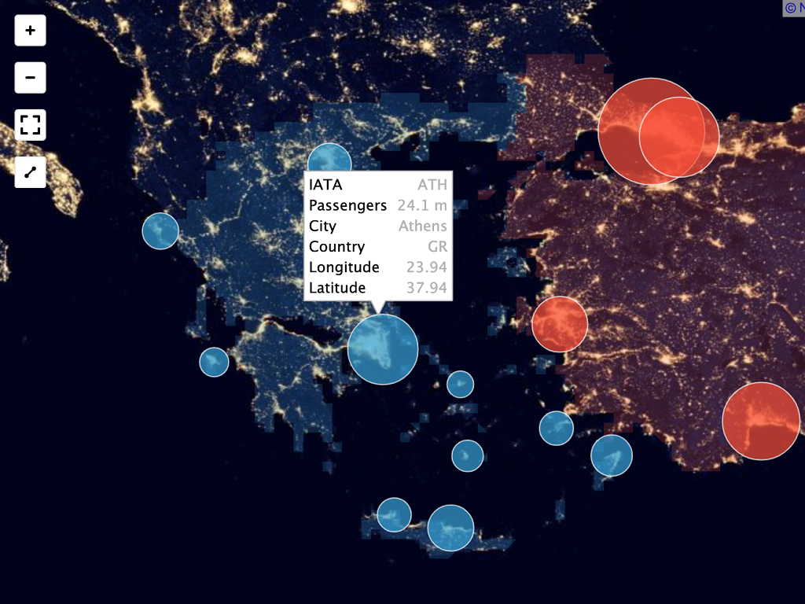
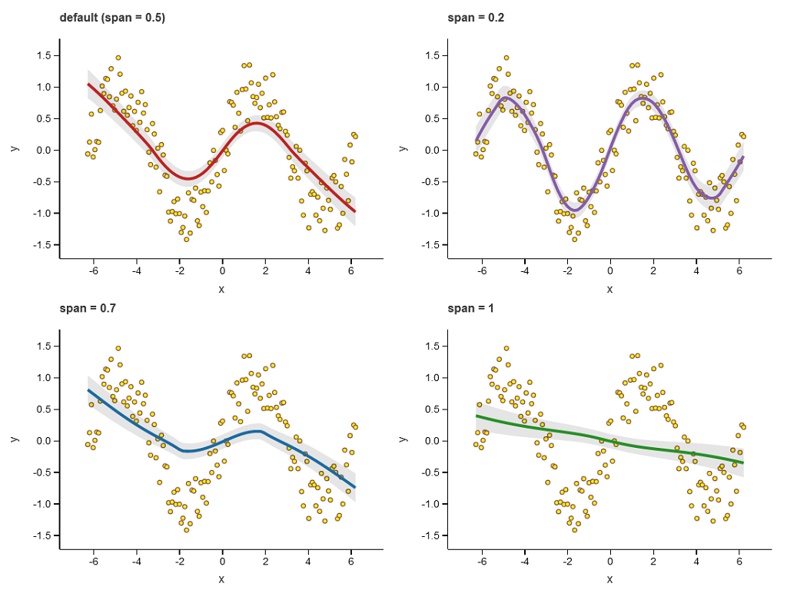
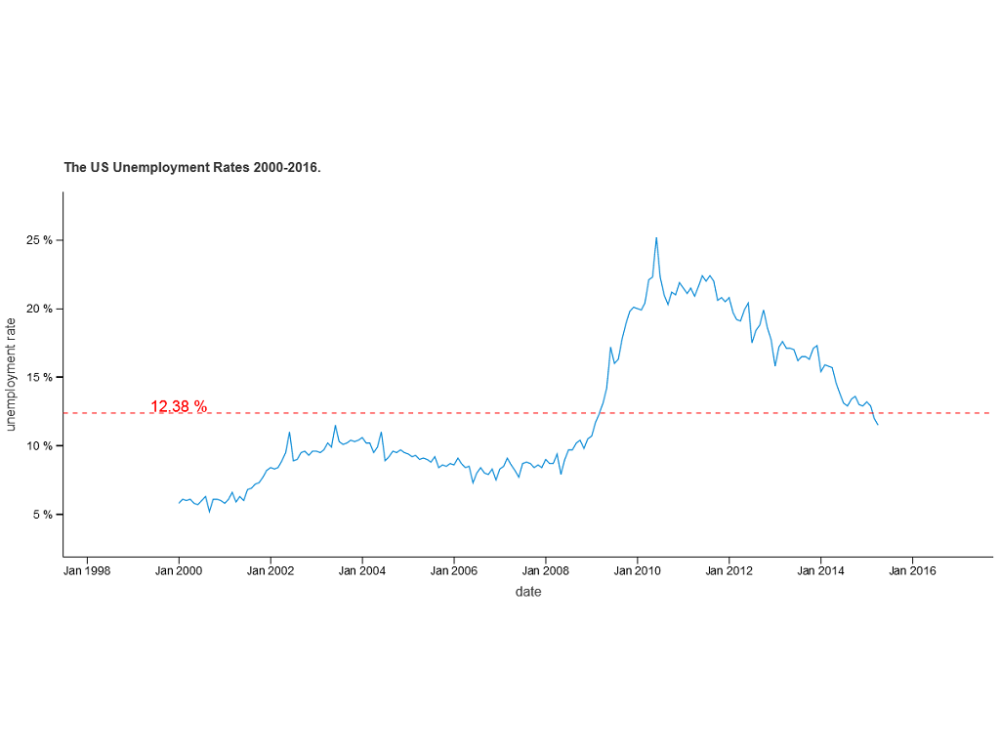

.. _index

.. lets-plot documentation master file, created by
   sphinx-quickstart on Fri May 15 17:50:59 2020.
   You can adapt this file completely to your liking, but it should at least
   contain the root `toctree` directive.

Declarative Data Visualization with Lets-Plot
=============================================

.. panels::
    :container: + preview-window
    :column: col-lg-12 p-2

    |visualization-of-airport-data-on-map|

.. |geopandas_kotlin_isl| image:: _static/images/previews/geopandas_kotlin_isl_1024x768.png
    :target: https://nbviewer.jupyter.org/github/JetBrains/lets-plot/blob/master/docs/examples/jupyter-notebooks/geopandas_kotlin_isl.ipynb

.. panels::
    :container: + preview-picker
    :column: col-lg-3 col-md-4 col-sm-6 col-xs-12 p-2

    .. image:: _static/images/previews/visualization-of-airport-data-on-map_200x200.png
        :target: https://www.kaggle.com/alshan/visualization-of-airport-data-on-map

    ---
    .. image:: _static/images/previews/geom_smooth_200x200.png
        :target: https://nbviewer.jupyter.org/github/JetBrains/lets-plot/blob/master/docs/examples/jupyter-notebooks/geom_smooth.ipynb

    ---
    .. image:: _static/images/previews/geopandas_kotlin_isl_200x200.png
        :target: https://nbviewer.jupyter.org/github/JetBrains/lets-plot/blob/master/docs/examples/jupyter-notebooks/geopandas_kotlin_isl.ipynb

    ---
    .. image:: _static/images/previews/formatting_axes_etc_200x200.png
        :target: https://nbviewer.jupyter.org/github/JetBrains/lets-plot/blob/master/docs/examples/jupyter-notebooks/formatting_axes_etc.ipynb

.. raw:: html

    

      

        <a href="https://pypi.org/project/lets-plot" target="_blank">
          <button>Install with pip</button>
        </a>
      

      

        <a href="#" class="reference internal">Installation Guide</a>
      

    

.. panels::
    :column: col-lg-8 col-md-4 col-sm-6 col-xs-12 p-2

    About Lets-Plot
    ^^^^^^^^^^^^^^^

    The Lets-Plot for Python library includes a native backend and a Python API, which was mostly based on the `ggplot2 <https://ggplot2.tidyverse.org>`__ package well-known to data scientists who use R.

    So you have an excellent possibility to learn the grammar of graphics with Lets-Plot.

    ---
    :column: col-lg-4 col-md-4 col-sm-6 col-xs-12 p-2
    .. image:: _static/images/the-grammar-of-graphics-cover.jpg
        :target: https://www.springer.com/gp/book/9781475731002

Try it now with Datalore
------------------------

You can try the Lets-Plot library in `Datalore <https://datalore.jetbrains.com>`__. Lets-Plot is available in Datalore out-of-the-box.

The advantage of `Datalore <https://datalore.jetbrains.com>`__ as a learning tool in comparison to Jupyter is that it is equipped with very friendly Python editor which comes with auto-completion, intentions, and other useful coding assistance features.

Begin with the `quickstart in Datalore <https://view.datalore.io/notebook/Zzg9EVS6i16ELQo3arzWsP>`__ notebook to learn more about Datalore notebooks.

.. raw:: html

    

      

    

    

Quickstart
----------

You can use Lets-Plot in Jupyter notebook or other notebook of your choice, like Datalore, Kaggle or Colab.

To evaluate the plotting capabilities of Lets-Plot, add the following code to a Jupyter notebook:

.. jupyter-execute::
    :linenos:

    import numpy as np
    from lets_plot import *
    LetsPlot.setup_html()        

    np.random.seed(12)
    data = dict(
        cond=np.repeat(['A','B'], 200),
        rating=np.concatenate((np.random.normal(0, 1, 200), np.random.normal(1, 1.5, 200)))
    )

    ggplot(data, aes(x='rating', fill='cond')) + ggsize(500, 250) + \
        geom_density(color='dark_green', alpha=.7) + scale_fill_brewer(type='seq') + \
        theme(axis_line_y='blank')

.. panels::
    :container: + platforms-for-lets-plot
    :column: col-lg-2 col-md-4 col-sm-6 col-xs-12 p-2

    .. image:: https://upload.wikimedia.org/wikipedia/commons/3/38/Jupyter_logo.svg
        :target: https://nbviewer.jupyter.org/github/JetBrains/lets-plot/blob/master/docs/examples/jupyter-notebooks/quickstart.ipynb

    ---
    .. image:: https://raw.githubusercontent.com/JetBrains/lets-plot/master/docs/examples/images/logo_datalore.svg
        :target: https://view.datalore.io/notebook/Zzg9EVS6i16ELQo3arzWsP

    ---
    .. image:: _static/images/icon-pycharm.svg

    ---
    .. image:: https://raw.githubusercontent.com/JetBrains/lets-plot/master/docs/examples/images/logo_kaggle.svg
        :target: https://www.kaggle.com/alshan/lets-plot-quickstart

    ---
    .. image:: https://raw.githubusercontent.com/JetBrains/lets-plot/master/docs/examples/images/logo_colab.svg
        :target: https://colab.research.google.com/drive/1uYYZcG0g0kP4lJdPkpWB8aBS96ioDii2?usp=sharing

    ---
    .. image:: https://raw.githubusercontent.com/JetBrains/lets-plot/master/docs/examples/images/logo_deepnote.svg
        :target: https://deepnote.com/project/673ea421-638e-469d-8d04-5cc4c6e0258f#%2Fnotebook.ipynb

More Examples
-------------

.. panels::
    :container: + preview-gallery
    :column: col-lg-3 col-md-4 col-sm-6 col-xs-12 p-2

    .. image:: _static/images/previews/visualization-of-airport-data-on-map_200x200.png
        :target: https://www.kaggle.com/alshan/visualization-of-airport-data-on-map

    ---
    .. image:: _static/images/previews/geom_smooth_200x200.png
        :target: https://nbviewer.jupyter.org/github/JetBrains/lets-plot/blob/master/docs/examples/jupyter-notebooks/geom_smooth.ipynb

    ---
    .. image:: _static/images/previews/geopandas_kotlin_isl_200x200.png
        :target: https://nbviewer.jupyter.org/github/JetBrains/lets-plot/blob/master/docs/examples/jupyter-notebooks/geopandas_kotlin_isl.ipynb

    ---
    .. image:: _static/images/previews/formatting_axes_etc_200x200.png
        :target: https://nbviewer.jupyter.org/github/JetBrains/lets-plot/blob/master/docs/examples/jupyter-notebooks/formatting_axes_etc.ipynb

    ---
    .. image:: _static/images/previews/geom_smooth_200x200.png
        :target: https://nbviewer.jupyter.org/github/JetBrains/lets-plot/blob/master/docs/examples/jupyter-notebooks/geom_smooth.ipynb

    ---
    .. image:: _static/images/previews/geopandas_kotlin_isl_200x200.png
        :target: https://nbviewer.jupyter.org/github/JetBrains/lets-plot/blob/master/docs/examples/jupyter-notebooks/geopandas_kotlin_isl.ipynb

    ---
    .. image:: _static/images/previews/formatting_axes_etc_200x200.png
        :target: https://nbviewer.jupyter.org/github/JetBrains/lets-plot/blob/master/docs/examples/jupyter-notebooks/formatting_axes_etc.ipynb

    ---
    .. image:: _static/images/previews/visualization-of-airport-data-on-map_200x200.png
        :target: https://www.kaggle.com/alshan/visualization-of-airport-data-on-map

    ---
    .. image:: _static/images/previews/geopandas_kotlin_isl_200x200.png
        :target: https://nbviewer.jupyter.org/github/JetBrains/lets-plot/blob/master/docs/examples/jupyter-notebooks/geopandas_kotlin_isl.ipynb

    ---
    .. image:: _static/images/previews/formatting_axes_etc_200x200.png
        :target: https://nbviewer.jupyter.org/github/JetBrains/lets-plot/blob/master/docs/examples/jupyter-notebooks/formatting_axes_etc.ipynb

    ---
    .. image:: _static/images/previews/visualization-of-airport-data-on-map_200x200.png
        :target: https://www.kaggle.com/alshan/visualization-of-airport-data-on-map

    ---
    .. image:: _static/images/previews/geom_smooth_200x200.png
        :target: https://nbviewer.jupyter.org/github/JetBrains/lets-plot/blob/master/docs/examples/jupyter-notebooks/geom_smooth.ipynb

.. raw:: html

    

      <a href="#" class="reference internal">Show More</a>
    
